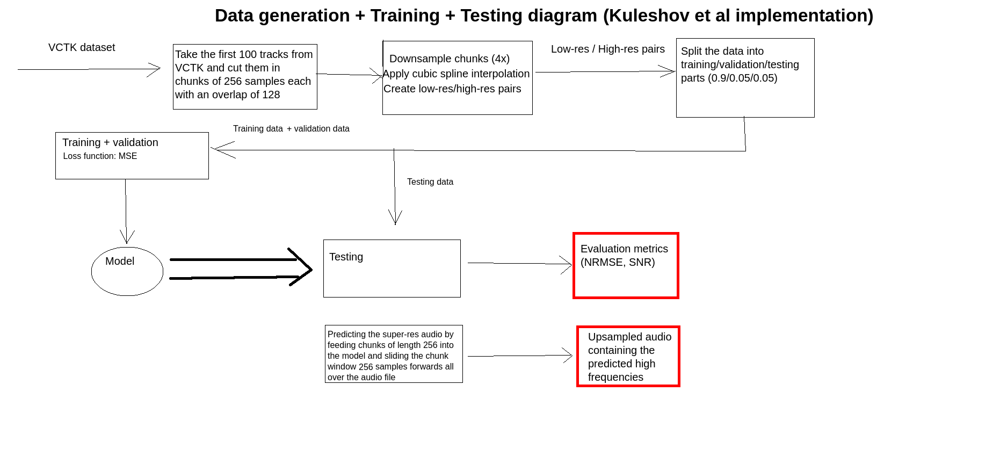

# Audio Super-Resolution
A project focused on the super-resolution of audio signals i.e improving sound quality of a digital recording, be it a vocal recording or music. 

## Dataset
The datasets used will be VCTK and some music dataset, possibly MagnaTagATune or The Million Song dataset.

## Main references
 - [X] [Audio Super-Resolution Using Neural Nets](https://arxiv.org/pdf/1708.00853v1.pdf)
 - [X] [Time-frequency Networks For Audio Super-Resolution](https://teckyianlim.me/audio-sr/res/3828.pdf)
 - [ ] [Adversarial Training for Speech Super-Resolution](https://www.researchgate.net/publication/332201260_Adversarial_Training_for_Speech_Super-Resolution)
 - [ ] [Phase-aware music super-resolution using generative adversarial networks](https://arxiv.org/pdf/2010.04506.pdf)
 - [ ] [Bandwidth extension on raw audio via generative adversarial networks](https://arxiv.org/pdf/1903.09027.pdf)

## Related papers that could be used as references

### Audio signals
 - [MidiNet: A Convolutional Generative Adversarial Network for Symbolic-domain Music Generation](https://arxiv.org/pdf/1703.10847.pdf)
 - [On the evaluation of generative models in music](https://musicinformatics.gatech.edu/wp-content_nondefault/uploads/2018/11/postprint.pdf)
 - [INCO-GAN: Variable-Length Music Generation Method Based
on Inception Model-Based Conditional GAN](https://www.google.com/url?sa=t&rct=j&q=&esrc=s&source=web&cd=&ved=2ahUKEwj62YWr14_0AhXch_0HHf0dDckQFnoECAQQAQ&url=https%3A%2F%2Fwww.mdpi.com%2F2227-7390%2F9%2F4%2F387%2Fpdf&usg=AOvVaw1Bt1-i7aM7Fp8OmwRJ2GtX)
 - [WSRGlow: A Glow-based Waveform Generative Model for Audio Super-Resolution](https://arxiv.org/abs/2106.08507)
 - [Self-Attention for Audio Super-Resolution](https://arxiv.org/pdf/2108.11637v1.pdf)
 - [On Filter Generalization for Music Bandwidth Extension Using Deep Neural Networks](https://arxiv.org/pdf/2011.07274v2.pdf)
 - [NU-Wave: A Diffusion Probabilistic Model for Neural Audio Upsampling](https://arxiv.org/pdf/2104.02321v2.pdf)
 - [Temporal FiLM: Capturing Long-Range Sequence Dependencies with Feature-Wise Modulation](https://arxiv.org/pdf/1909.06628v3.pdf)
 - [Learning Continuous Representation of Audio for Arbitrary Scale Super Resolution](https://arxiv.org/pdf/2111.00195.pdf)
 - [An investigation of pre-upsampling generative modelling and Generative Adversarial Networks in audio super resolution](https://arxiv.org/pdf/2109.14994.pdf)
 - [TUNet: A Block-online Bandwidth Extension Model based on Transformers and Self-supervised Pretraining](https://arxiv.org/pdf/2110.13492v3.pdf)
 - [Vision-Infused Deep Audio Inpainting](https://arxiv.org/pdf/1910.10997.pdf)
 - [VoiceFixer: Toward General Speech Restoration with Neural Vocoder](https://arxiv.org/pdf/2109.13731.pdf)
 - [Sound field reconstruction in rooms: inpainting
meets super-resolution](https://arxiv.org/pdf/2001.11263.pdf)
 - [High-quality Speech Synthesis Using Super-resolution Mel-Spectrogram ](https://arxiv.org/pdf/1912.01167.pdf)
 - [Enabling Real-time On-chip Audio Super Resolution for Bone
Conduction Microphones](https://arxiv.org/pdf/2112.13156.pdf)
 - [Speech bandwidth expansion based on Deep Neural Networks](https://www.researchgate.net/publication/325682935_Speech_bandwidth_expansion_based_on_Deep_Neural_Networks)

### Image super-resolution 
 - [Photo-Realistic Single Image Super-Resolution Using a Generative Adversarial
Network](https://arxiv.org/pdf/1609.04802.pdf)

### Time-series
 - [Imaging Time-Series to Improve Classification and Imputation](https://arxiv.org/pdf/1506.00327.pdf)

### Generative models
 - [Wasserstein GANs](https://arxiv.org/pdf/1701.07875.pdf)
 - [STGAN: A Unified Selective Transfer Network
for Arbitrary Image Attribute Editing](https://arxiv.org/pdf/1904.09709.pdf)

### Possibly useful
 - [Audio Super-Resolution Using Analysis Dictionary
Learning](http://personal.ee.surrey.ac.uk/Personal/W.Wang/papers/DongWC_DSP_2015.pdf)

### Blogs
 - [Using Deep-Learning to Reconstruct High-Resolution Audio](https://blog.insightdatascience.com/using-deep-learning-to-reconstruct-high-resolution-audio-29deee8b7ccd)

### Datasets
 - [The Million Song Dataset](https://www.ee.columbia.edu/~dpwe/pubs/BertEWL11-msd.pdf)

## Possible uses
 - Improving sound quality of music
 - Voice-over-IP applications
 - Improving speech recognition
 - Remastering audio from old movies
 - Reconstructing old phonograph recordings (This one might be a bit far-fetched, since a lot of data is needed. It might actually be impossible.)

## Converting a spectrogram to audio (might be useful later)
The Python module [librosa](https://librosa.org/doc/latest/index.html) can transform an audio signal into a spectrogram and vice-versa
by using the [Griffin-Lim algorithm](https://stackoverflow.com/questions/61132574/can-i-convert-spectrograms-generated-with-librosa-back-to-audio).

## Math and signal processing links 
 - [What is convolution? This is the easiest way to understand](https://www.youtube.com/watch?v=QmcoPYUfbJ8)
 - [Introducing Convolutions](https://www.youtube.com/watch?v=N-zd-T17uiE)
 - [Valerio Velardo's Audio Signal Processing for Machine Learning Playlist](https://www.youtube.com/watch?v=iCwMQJnKk2c&list=PL-wATfeyAMNqIee7cH3q1bh4QJFAaeNv0)
 - [Steve Brunton's Fourier Analysis Playlist](https://www.youtube.com/watch?v=jNC0jxb0OxE&list=PLMrJAkhIeNNT_Xh3Oy0Y4LTj0Oxo8GqsC)
 - [Sampling, Aliasing & Nyquist Theorem](https://www.youtube.com/watch?v=yWqrx08UeUs)
 - [Interpolation](https://www.youtube.com/watch?v=RpxoN9-i7Jc)
 - [Difference between logged-power spectrum and power spectrum](https://dsp.stackexchange.com/questions/38319/difference-between-logged-power-spectrum-and-power-spectrum)
 - [Linear and logarithmic scales](https://www.indeed.com/career-advice/career-development/logarithmic-scale)
 - [Decibel conversion](https://dspillustrations.com/pages/posts/misc/decibel-conversion-factor-10-or-factor-20.html?rid=so6)

## Research advices
 - [How to Read AI (Audio) Research Papers Like a Rockstar](https://www.youtube.com/watch?v=tBoSIzilP-Y)
	1. Skimming
		- read the abstract
		- read introduction + conclusion
		- check out figures and tables
		- ignore details	

	2. Reading the details
		- What's the state-of-the-art?
		- What are the tools/techniques used?
		- How did the authors evaluate their solution?
		- What are the results of the experiments?

	3. Question everything
		- Do I understand everything the authors say?
		- Is the paper sound?
		- What would I have done differently?
		- Read referenced research papers
		- Internalise the math
		- Re-think the problem
		- Explain the paper to friends/colleagues

	4. Check the code
		- Check the author's implementation
		- Re-implement the proposed solution
		- Run experiments

 - [How to Conduct Literature Review Effectively](https://www.youtube.com/watch?v=FRdVqWquroc) 

	Select resource &rarr; Read resource &rarr; Take notes (topic, approach, results, contributions, limitations/weaknesses) &rarr; Keep track of reference &rarr; Summarise literature review findings

 - [How to Select AI (Audio) Papers Effectively](https://www.youtube.com/watch?v=UEdWuu8hqrg)

 - [How to Summarize a Research Article](https://writingcenter.uconn.edu/wp-content/uploads/sites/593/2014/06/How_to_Summarize_a_Research_Article1.pdf)

## A quick implementation of ["Audio Super Resolution Using Neural Networks (Kuleshov, Enam, Ermon, 2017)"](https://arxiv.org/pdf/1708.00853v1.pdf)

  

 - [X] Write the data generator scripts (obtaining the low-res/high-res pairs of audio clips)
 - [X] Write the training/testing scripts 
 - [X] read more about why the loss approaches the nan value during training 
	 -  usually, it is either because of an exploding gradient or a vanishing gradient (in my case, I accidentally used NRMSE as a loss function instead of using it only as a metric, the number was so small that Keras displayed the loss as being "nan")
	 - relevant StackOverflow post: https://stackoverflow.com/questions/37232782/nan-loss-when-training-regression-network 
 - [X] create plots with the training and validation loss
 - [X] train 100 epochs
 - [X] adjust the data split to use all of the generated data from the first 100 tracks of VCTK for training/validation/testing
 - [X] Finish testing/prediction script:
	- [X] Downsample test audio track
	- [X] Feed chunks of 256 samples of the audio to the model 
	- [X] Display spectrogram of the output
	- [X] Save the low-res/high-res/super-res numpy arrays as audio and compare them

